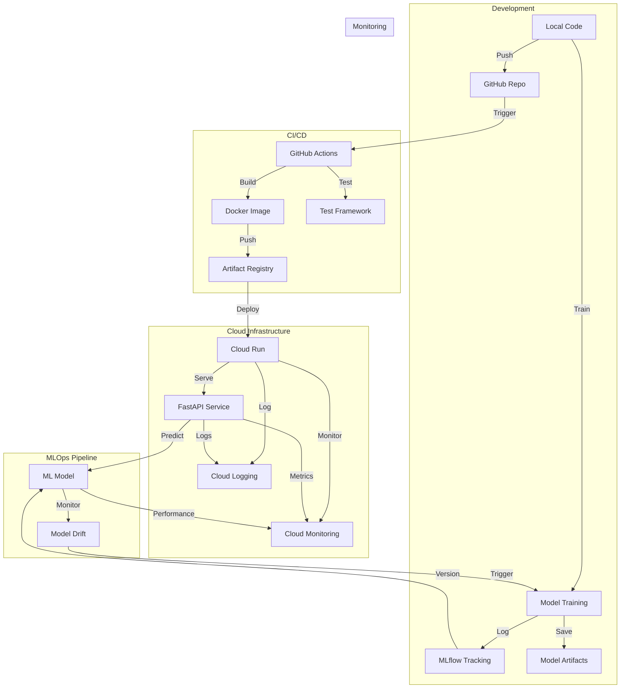

# AI Agent Instructions for Cancer Detection MLOps Project

## System Architecture Overview



## Component Integration Summary

1. **Development & Training Flow**
   - Local development with Python 3.11
   - MLflow experiment tracking
   - Model versioning and artifacts
   - Automated testing framework

2. **CI/CD Pipeline**
   - GitHub Actions automation
   - Multi-stage Docker builds
   - Security scanning (Trivy)
   - OIDC authentication

3. **Cloud Infrastructure**
   - Google Cloud Run deployment
   - Artifact Registry for images
   - Workload Identity Federation
   - Auto-scaling configuration

4. **API Service**
   - FastAPI with type validation
   - Health monitoring
   - Performance tracking
   - Error handling

5. **Monitoring & Observability**
   - Structured logging
   - Performance metrics
   - Health checks
   - Resource monitoring

6. **Cost & Resource Management**
   - Scale-to-zero capability
   - Resource optimization
   - Cost monitoring
   - Cleanup automation

## Key Integration Points

### Data Flow
1. Model Training → MLflow → Model Registry
2. Code → GitHub → Actions → Cloud Run
3. API Requests → Model Predictions → Monitoring

### Control Flow
1. GitHub Push → CI/CD Pipeline → Deployment
2. Health Checks → Autoscaling → Resource Management
3. Monitoring → Alerts → Incident Response

### Resource Flow
1. Development → Testing → Production
2. Docker Build → Registry → Deployment
3. Logs → Analytics → Optimization

## Critical Paths

1. **Model Deployment**
   ```
   Local Training → MLflow → Model Artifact → Cloud Run
   ```

2. **Code Deployment**
   ```
   Git Push → Actions → Docker → Cloud Run
   ```

3. **Prediction Flow**
   ```
   API Request → Load Balancer → Cloud Run → Model → Response
   ```

## Conventions & Standards

1. **Code Organization**
   - `src/`: Core ML and API code
   - `tests/`: Mirrored test structure
   - `infra/`: Infrastructure as Code
   - `pipelines/`: MLOps workflows

2. **Configuration Management**
   - Environment variables
   - Terraform variables
   - MLflow parameters
   - API configurations

3. **Monitoring Structure**
   - Health metrics
   - Performance tracking
   - Resource utilization
   - Cost analytics