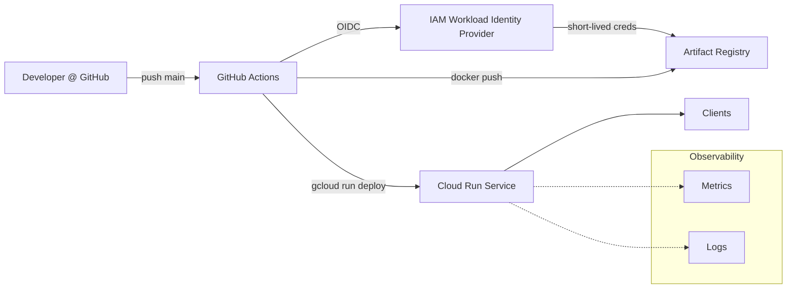

# Cloud Run + OIDC (Terraform & GitHub Actions), Dockerfile Hardening, and README Architecture Patch

This drop-in patch adds:

1. **Minimal Terraform** for Google Cloud Run deploys with **GitHub OIDC (no long‑lived keys)**
2. **GitHub Actions** workflow to build, scan, push to **Artifact Registry**, and deploy to **Cloud Run**
3. **Hardened Dockerfile** (multi‑stage, non‑root, pinned deps)
4. **README** additions: architecture diagram + runbooks (deploy, rollback, secret rotation, incident triage)

---

# Cloud Architecture & Operations

## High‑level diagram



## Components

* **GitHub OIDC → GCP**: GitHub obtains ephemeral credentials via Workload Identity Federation to impersonate a **deployer** service account.
* **Artifact Registry (Docker)**: Stores built images tagged by commit SHA.
* **Cloud Run (fully managed)**: Runs the FastAPI app; scales to zero; public by default (can be locked down).
* **Runtime Service Account**: Minimal permissions; add Secret Manager access if configs are stored as secrets.
* **Observability**: Export basic metrics/logs to Cloud Monitoring & Logging; expose `/healthz` and `/metrics` if needed.

## Deploy (CI/CD)

1. Push/merge to `main`.
2. GitHub Actions: lint & security scan → build image → push to Artifact Registry → `gcloud run deploy`.
3. Output: service URL printed in job logs.

## Rollback

* Re‑deploy a previous image:

  ```bash
  gcloud run deploy $SERVICE_NAME \
    --image ${REGION}-docker.pkg.dev/${PROJECT}/${REPO}/${SERVICE_NAME}:<OLD_SHA> \
    --region $REGION
  ```
* Or use Cloud Run **Revisions** in the console to roll back to a known‑good revision.

## Secret management

* Store secrets in **Secret Manager**:

  ```bash
  echo -n "<VALUE>" | gcloud secrets create API_KEY --data-file=-
  gcloud secrets versions add API_KEY --data-file=<(echo -n "<NEW_VALUE>")
  ```
* Mount as env vars or volumes via Cloud Run configuration. Grant `roles/secretmanager.secretAccessor` to the **runtime** SA.

## Incident triage (golden signals)

* **Availability**: `/healthz` must return 200.
* **Latency**: track P50/P95 request latency in Cloud Monitoring.
* **Errors**: monitor 5xx rate; set alert policies.
* **Saturation**: watch concurrent requests vs. instance limit.

## Cost controls

* Set reasonable **max instances** in Cloud Run template.
* Keep images slim; prune old tags in Artifact Registry.
* Rely on scale‑to‑zero for idle workloads.

---

# Developer Quick Start

1. **Provision infra**:

   ```bash
   cd infra/terraform
   terraform init
   terraform apply -var="project_id=<YOUR_GCP_PROJECT_ID>" -var="region=europe-west1" -var="github_owner=angelnenov7" -var="github_repo=cancer-detection-mlops"
   ```

   Copy the outputs for GitHub secrets.

2. **Configure GitHub repo settings**:

   * Variables: `GCP_PROJECT_ID`, `GCP_REGION`, `AR_REPO`, `SERVICE_NAME`
   * Secrets: `WIF_PROVIDER`, `DEPLOYER_SA`

3. **Push to main**: triggers CI/CD → builds, scans, pushes, deploys.

4. **Verify**: Open the Cloud Run URL from the Actions log, hit `/healthz` endpoint.

---

# Local developer helpers

**Makefile** targets:

```makefile
lint:
	ruff check .
	bandit -r src || true

build:
	docker build -t $(IMAGE) .

push:
	docker push $(IMAGE)

deploy:
	gcloud run deploy $(SERVICE_NAME) --image $(IMAGE) --region $(REGION) --platform managed --allow-unauthenticated --service-account run-runtime@$(PROJECT).iam.gserviceaccount.com --quiet
```

---

# Notes

* Replace the `uvicorn` app path in `Dockerfile` if your FastAPI `app` lives outside `src/app.py`.
* Keep dependencies pinned in `requirements.txt`.
* To avoid charges, stay within **Cloud Run free tier** and small Artifact Registry storage (0.5 GB free).
* For private deployments, remove the `allUsers` invoker IAM binding in Terraform.
